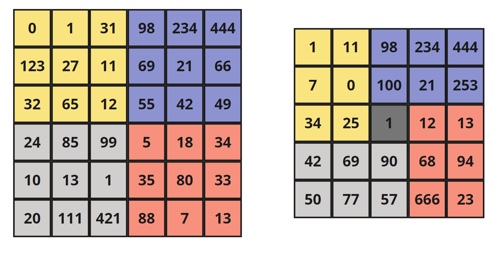
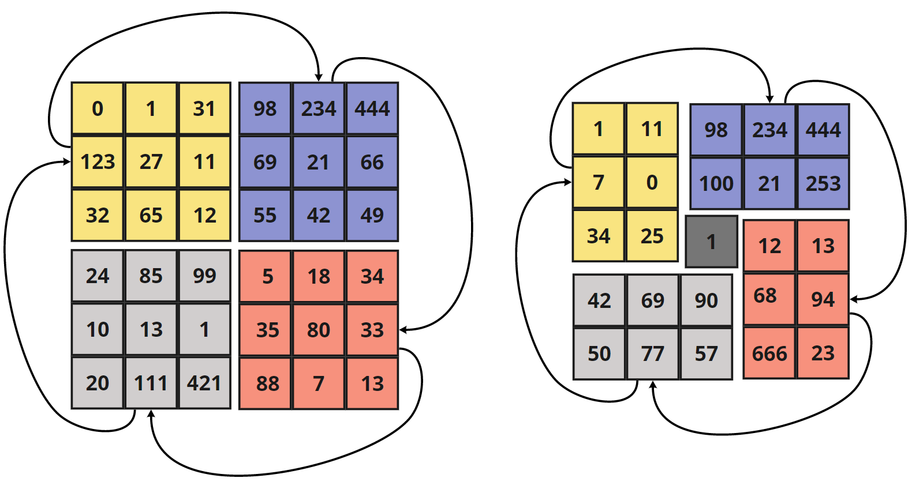
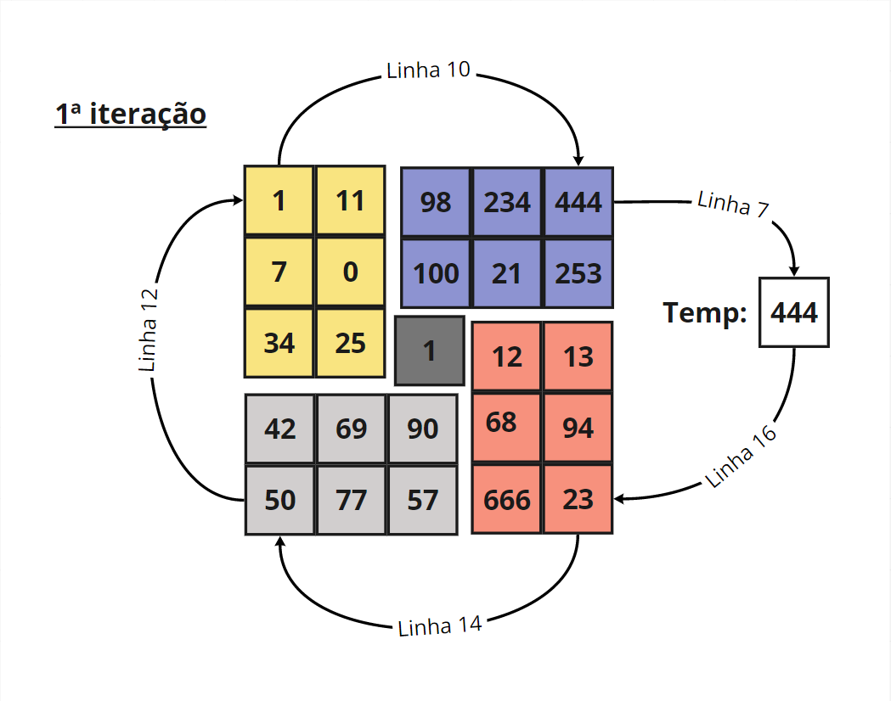
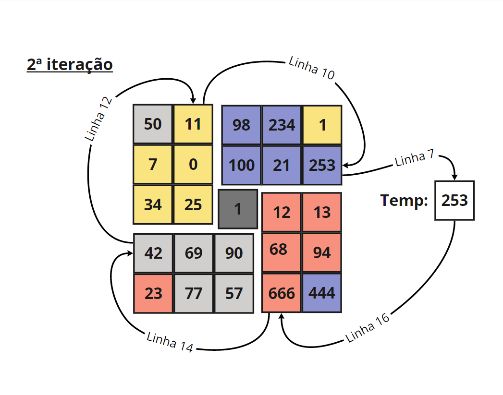
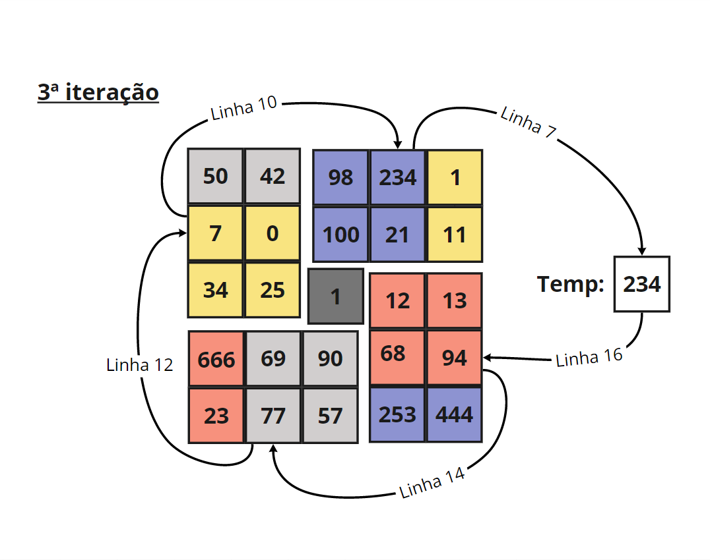
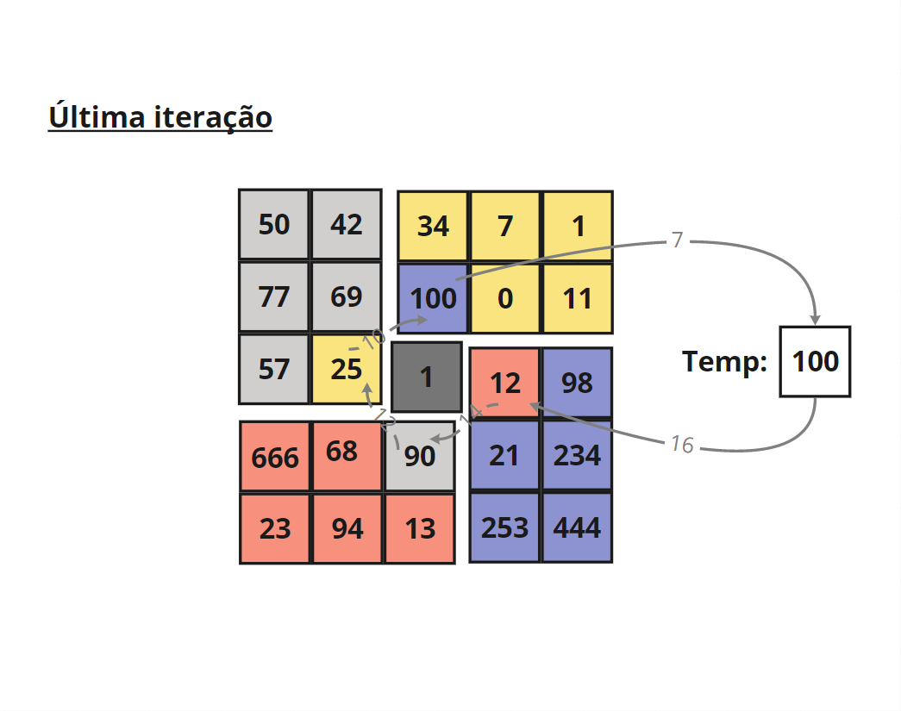
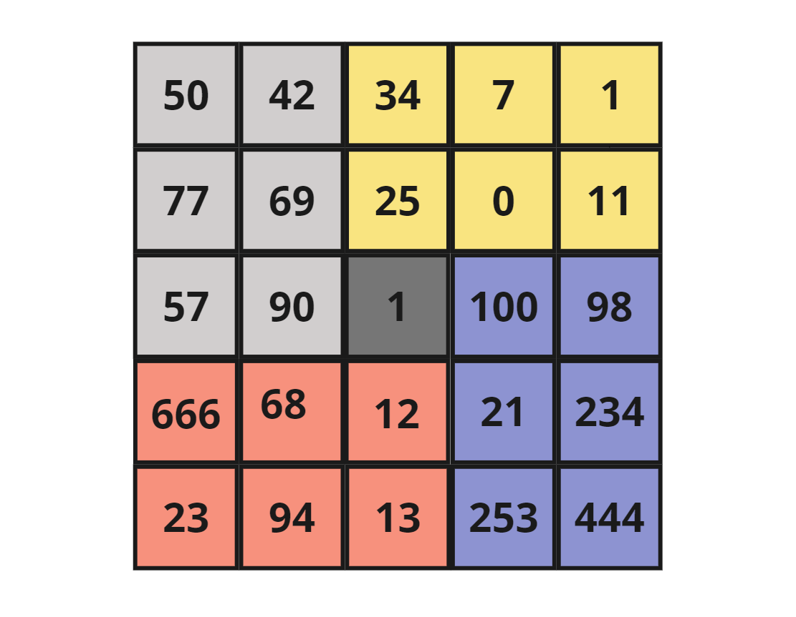

# Day 007: Arrays #1

## [Rotate Image](https://leetcode.com/problems/rotate-image/)
```cpp=
 1| class Solution {
 2| public: 
 3|     void rotate(vector<vector<int>>& matrix) {
 4|         int n = matrix[0].size();
 5|         for (int i = 0; i < n / 2 + n % 2; i++) {
 6|             for (int j = 0; j < n / 2; j++) {
 7|                 // guardando superior-direito
 8|                 int temp = matrix[j][n-1-i];
 9|                 
10|                 // superior-esquerdo para superior-direito
11|                 matrix[j][n-1-i] = matrix[i][j]; 
12|                 // inferior-esquerdo para superior-esquerdo
13|                 matrix[i][j] = matrix[n-1-j][i];
14|                 // inferior-direito para inferior-esquerdo
15|                 matrix[n-1-j][i] = matrix[n-1-i][n-1-j];
16|                 // superior-direito para inferior-direito
17|                 matrix[n-1-i][n-1-j] = temp;
18|             }
19|         }
20|     }
21| };
```

### Resolução
* Tomando a matrix dividida em 4 quadrantes. Abaixo temos a representação para quando a matriz tem dimensão par e ímpar, respectivamente:


* Precisamos rotatacionar os quadrantes no sentido horário, como mostrado a baixo:


* Fazemos isso iterando pelo quadrante superior-esquerdo (amarelo), realizando um "swap quadruplo" com os elementos respectivos nos outros quadrantes (de acordo com i e j), segue o exemplo:




&nbsp;&nbsp;&nbsp;&nbsp;&nbsp; Seguindo dessa forma até terminar todo o quadrante superior-esquerdo:
&nbsp;&nbsp;&nbsp;&nbsp;&nbsp; 

* Por fim, temos a matriz rotacionada:


### Complexidades
* Espaço: O(1)
* Tempo: O(n^2)